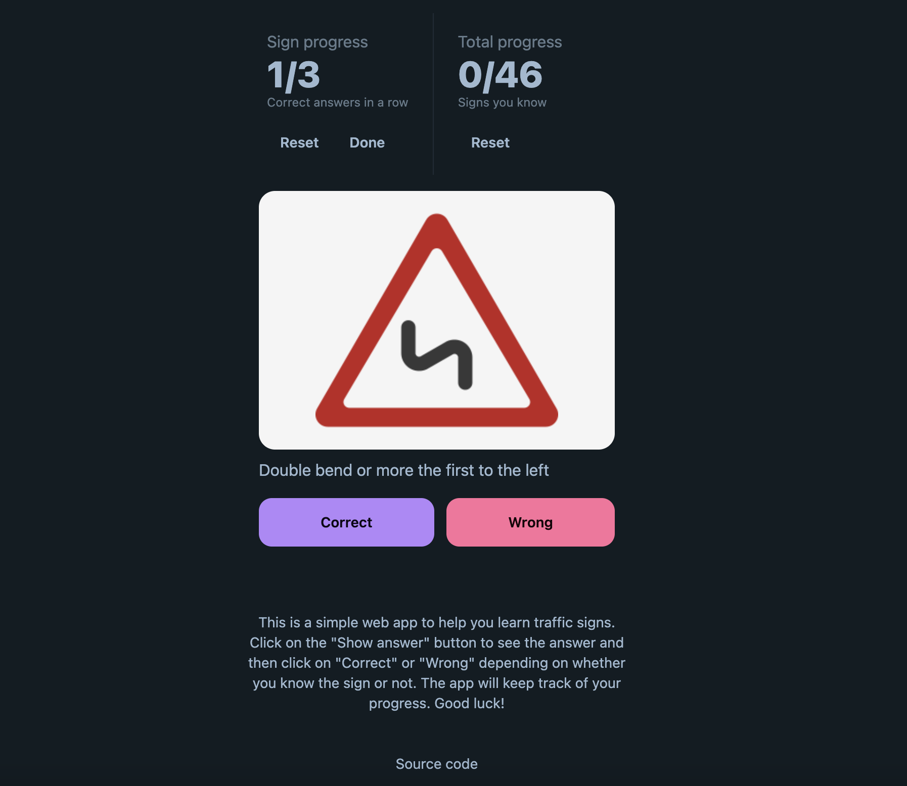

# Road signs training
_[signs.onrender.com](https://signs.onrender.com/)_

This is a simple project built with [alpine.js](https://alpinejs.dev/), [daisyui](https://daisyui.com/) and
[tailwindcss](https://tailwindcss.com/) to learn road signs.

### Project code
Just one file -  [static/index.html](static/index.html).

### How to add new sign

1. Fork project
2. Add image to `static/signs`
3. Add new sign to `signs.js`
4. Run `make build-static` (or `make watch-js` to continuously watch for changes)
5. Make PR
